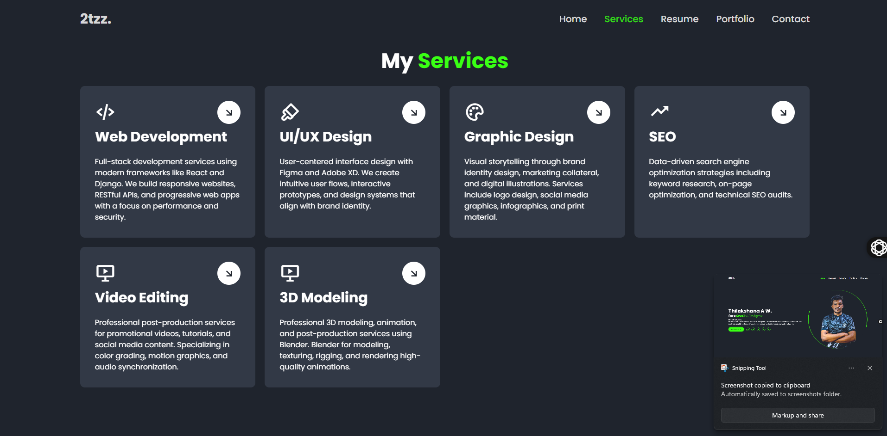
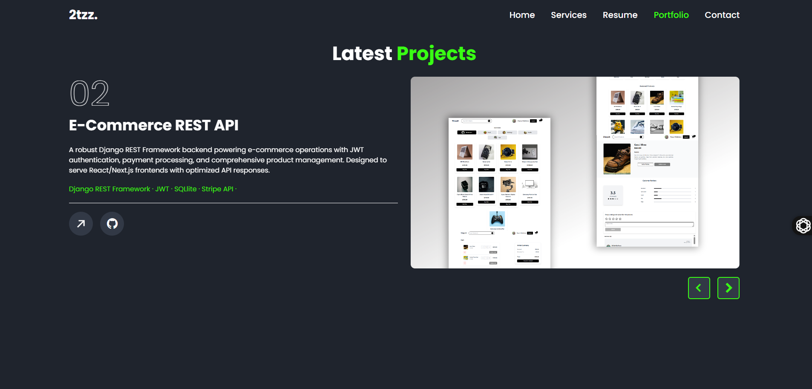
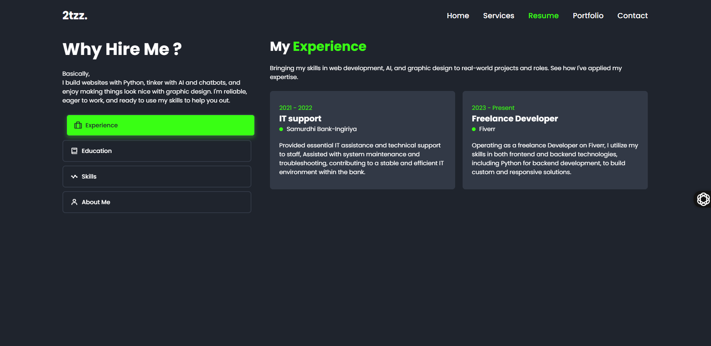
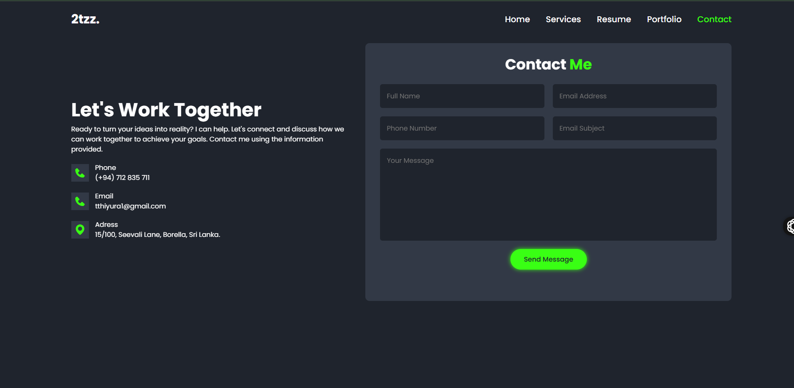

---

# 🧑‍💻 Personal Blog — Flask Web Application

Welcome to the source code repository for my **Flask-based blog website**, a minimal and clean personal blog platform built to demonstrate dynamic routing, template inheritance, and REST API integration. This project serves as a foundational template for creating content-driven websites using Flask and Jinja2.

---

## 📸 Preview








## 🚀 Live Website

👉 [click - me !](https://thilakshana.vip/)

---

## 🛠️ Technologies Used

The app is structured to highlight both design and backend functionality using:

### 🧩 Backend
- **Flask** – Lightweight web framework in Python.
- **Jinja2** – Template engine for Python (built into Flask).
- **Requests** – Used to fetch blog content dynamically from a JSON API.

### 🎨 Frontend
- **HTML5 + CSS3 + js**

- **Google Fonts** – Lora and Open Sans for elegant typography.
- **Font Awesome** – Icon set for UI enhancement.

.

---

## ✨ Features

✅ Dynamic routing   
✅ Static file management (CSS, JS, images)  
✅ Modular HTML templates (`header.html`, `footer.html`)  
✅ About & Contact pages  
✅ External API integration for send mails 

---

## 📁 Project Structure

```

personal\_website/
│
├── app.py                          # Flask app entry point
├── static/                         # Static assets
│   ├── css/
│   │   └── styles.css
│   ├── js/
│   │   └── scripts.js
│   ├── assets/
│       ├── favicon.ico
│       └── img/
│           └── post-bg.jpg
│
├── templates/                      # HTML templates
│   ├── index.html
│   ├── post.html
│   ├── about.html
│   ├── contact.html
│   ├── header.html
│   └── footer.html
│
└── README.md

````

---

## 🔧 Sample Code Snippets


### ➤ Jinja2 Template Loop

```jinja

    
        <h1>{{ blog_post["title"] }}</h1>
        <p>{{ blog_post["body"] }}</p>
    

```

