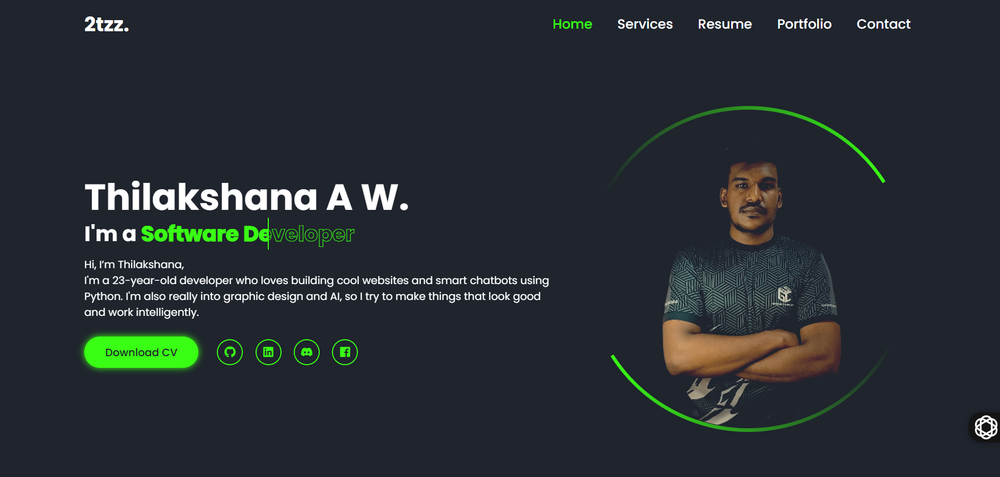
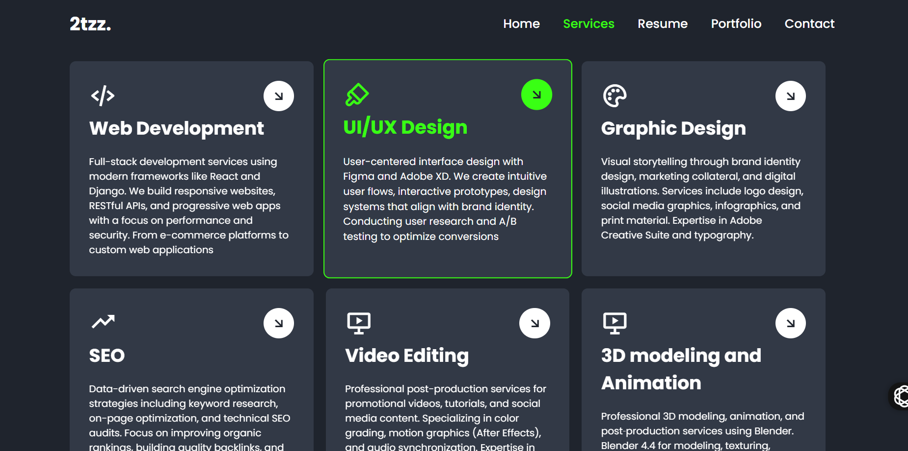
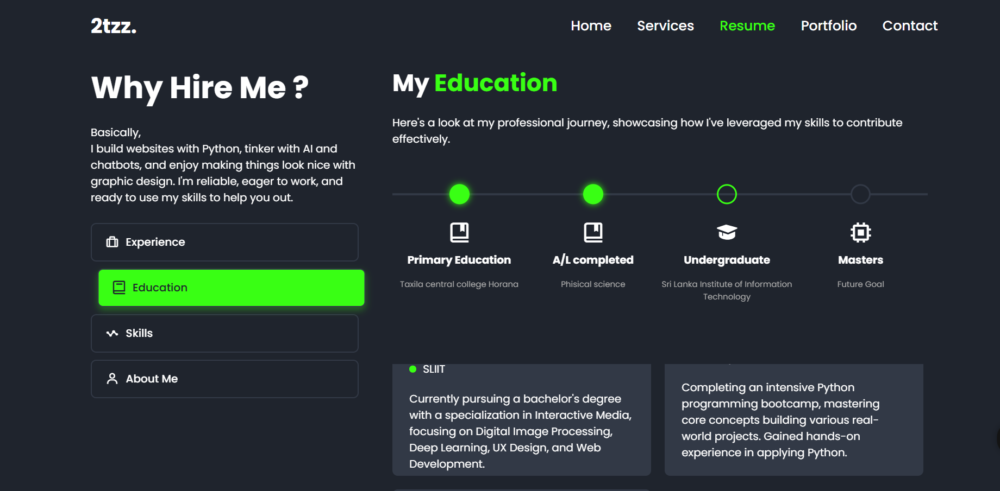
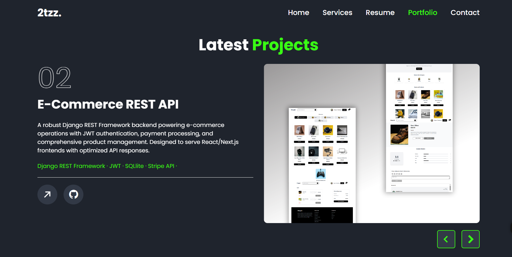
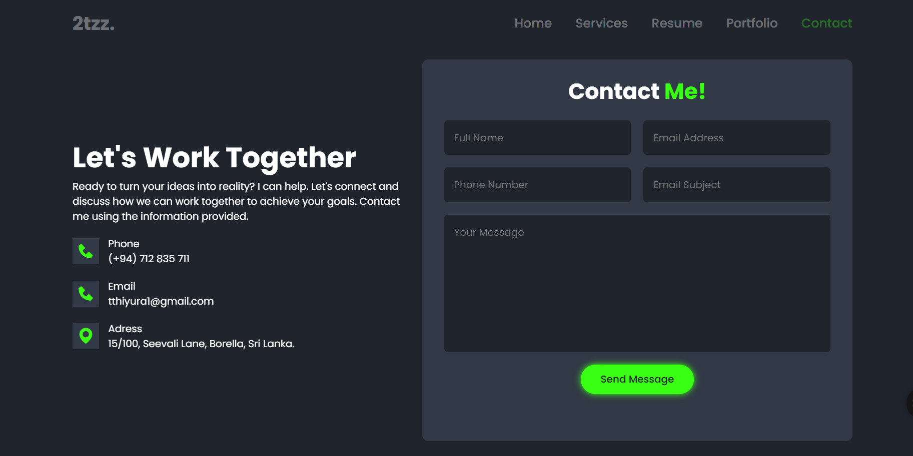

---

# 🧑‍💻 Thilakshana.vip — Personal Portfolio Website

Welcome to the source code repository for [thilakshana.vip](https://thilakshana.vip), the personal portfolio of **Thilakshana Weerasinghe**—a passionate software developer and creative designer from Sri Lanka. This website showcases my projects, services, and skills in web development, UI/UX design, and more.


---

## 📸 Preview





 <!-- Replace with an actual screenshot of your website -->

---

## 🚀 Live Website

👉 [click - me !](https://thilakshana.vip)

---

## 🛠️ Technologies Used

This website is built using a modern tech stack to ensure responsiveness, performance, and scalability:

* **Frontend**:
  * [Tailwind CSS](https://tailwindcss.com/) — Utility-first CSS framework for rapid UI development
  * [HTML5](https://developer.mozilla.org/en-US/docs/Web/Guide/HTML/HTML5) & [CSS3](https://developer.mozilla.org/en-US/docs/Web/CSS)


* **Additional Tools**:

  * [Figma](https://www.figma.com/) & [Adobe XD](https://www.adobe.com/products/xd.html) — UI/UX design
  * [Adobe Illustrator](https://www.adobe.com/products/illustrator.html) — Graphic design
  * [Premiere Pro](https://www.adobe.com/products/premiere.html) & [CapCut](https://www.capcut.com/) — Video editing

---

## ✨ Features

* **Responsive Design**: Optimized for desktops, tablets, and mobile devices.
* **Interactive UI/UX**: Engaging user interface with smooth animations and transitions.
* **Project Showcase**: Detailed sections highlighting major projects with descriptions and links.
* **Service Listings**: Overview of services offered, including web development, design, SEO, and more.
* **Contact Form**: Easy-to-use form for visitors to get in touch.
* **SEO Optimized**: Implemented best practices to enhance search engine visibility.

---

## 📁 Project Structure

```
personal_website/
├── backend/                # backend
│   ├── api/                     
│   └── ...
├── frontend/              
│   ├── public/             # Static files
│   ├── src/                # React components and pages
│   └── ...
├── media/                  # Uploaded media files
├── static/                 # HTML templates         
└── README.md               # Project documentation
```


---

## 🧑‍💼 About Me

I'm **Thilakshana Weerasinghe**, a 23-year-old developer passionate about creating innovative digital solutions. With a strong foundation in Python and a keen eye for design, I specialize in building responsive websites, developing intelligent chatbots, and crafting compelling visual content.

* **Location**: Borella, Sri Lanka
* **Email**: [tthiyura1@gmail.com](mailto:tthiyura1@gmail.com)
* **Phone**: (+94) 712 835 711
* **Freelance**: Available
* **Resume**: [Download CV](https://thilakshana.vip/cv.pdf) <!-- Replace with actual CV link -->

---

## 📈 Projects Highlight

### 1. [StudyBuddy - Real-time Developer Chat](https://studybuddev.herokuapp.com/)

A real-time chat application for developers to connect, share knowledge, and collaborate.

* **Technologies**: Django, Python, JavaScript, SQLite

### 2. E-Commerce REST API

A robust backend for e-commerce operations with JWT authentication and payment processing.

* **Technologies**: Django REST Framework, Python, PostgreSQL


## 📬 Contact

For inquiries, collaborations, or feedback:

* **Email**: [tthiyura1@gmail.com](mailto:tthiyura1@gmail.com)
* **Phone**: (+94) 712 835 711
* **Website**: [cleck - me !](https://thilakshana.vip)

---

